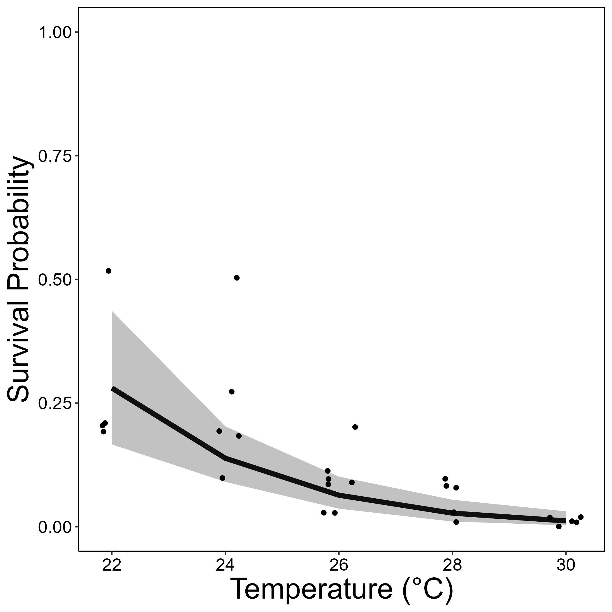
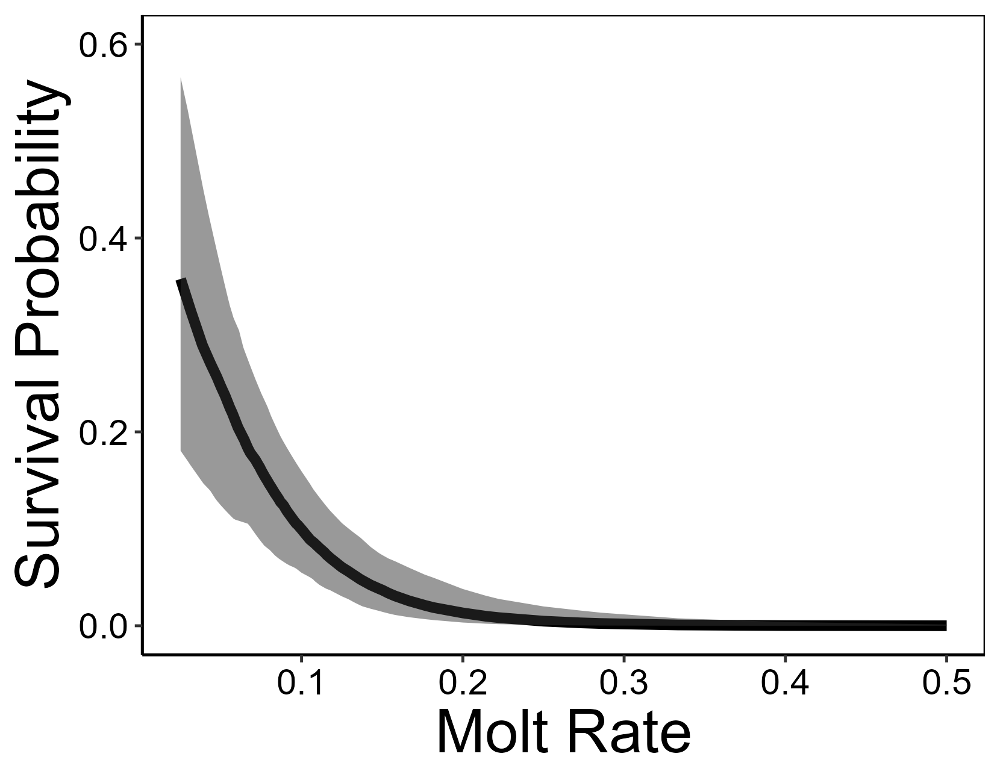

```{r setup, include=FALSE}
knitr::opts_chunk$set(echo = FALSE, warning = FALSE, message= FALSE)
```

```{r loadlibs}
library(lme4)
library(ggplot2)

```

# Introduction

Rising global temperatures is forcing many species to shift their range distributions to track suitable climatic conditions [@chenRapidRangeShifts2011]. The ability of a species to successfully do so is largely dependent on dispersal [@bergAdaptDisperseUnderstanding2010], movement away from an organisms natal habitat which connects discrete populations. If a species is unable to respond to climate change through dispersal, they must adapt to higher temperatures or will face extinction [@bergAdaptDisperseUnderstanding2010]. Dispersal is a two-fold behavior, shaped by both dispersal ability (the physical and physiological ability to disperse) and dispersal propensity (the motivation to disperse). Dispersal ability can be treated as a foundation for the extent to which dispersal is possible. Dispersal propensity builds upon this foundation, if there is a physical capacity to disperse then an individual may or may not be motivated to do so, shaping the observed dispersal behavior [@steynDispersalPropensityNot2016]. Dispersal propensity may increase with temperature [@franzenClimatedependentDispersalRates2012]; however, dispersal ability and dispersal propensity can conflict with each other. when dispersal ability is impeded the independent effects of temperature on dispersal propensity cannot be expressed. Therefore, isolating the impacts of temperature on dispersal ability is important to understand changes in dispersal trends with temperature, elucidating the extent to which dispersal is possible and motivated. 

Temperature can alter dispersal ability through developmental and physiological changes that affect fitness. High temperatures typically increase metabolic rate and respiration, resulting in smaller body size [@sheridanShrinkingBodySize2011]. The impact of temperature on metabolic rate is especially apparent in ectotherms [@dillonGlobalMetabolicImpacts2010], organisms which rely on external temperature to regulate body temperature. Understanding the effects of temperature on dispersal ability is important to determine how the distribution and abundance of populations may change. 

In this study, we experimentally assessed the impacts of temperature on the development and dispersal ability in backswimmers (*Notonecta undulata*). Backswimmers are common semi-aquatic insects found in freshwater throughout North America and can facultatively disperse via flight [@clarkSeasonalDistributionLife1928]. Currently, there is no research to our knowledge that connects temperature to dispersal in backswimmers. We raised juvenile backswimmers in different temperatures during development then conducted a dispersal assay. We predicted that 1) high temperatures will increase backswimmer mortality, 2) high temperatures will lower body condition, and 3) the effects of temperature on body condition will determine dispersal rates. Our study is the first, to our knowledge, to collect long-term data on the impacts of temperature on backswimmers. Understanding the impacts of temperature on development is important to predict how population sizes and distributions are going to change as global temperatures rise.

# Methods

## Field Collection

Juvenile backswimmers for this project were opportunistically collected from ponds at the University of Toronto's Koffler Scientific Reserve field station. Only 2nd instar (out of 5 total instars) backswimmers were used to enter the temperature-manipulative experiment. We filtered through all collected backswimmers for 2nd instars using size matching. This project used sample size was 350 2nd instar backswimmers. Due to sampling effort constraints, backswimmmers were added to the experiment in 5 blocks on consecutive days to allow for the continuous sampling.

## Experimental Design

This project consists of two consecutive experiments. First, we assess the effects of temperature on backswimmer fitness (survival, developmental rate, body condition). Then, individuals that successfully survived to adulthood entered a dispersal assay; we related temperature during development and body condition to dispersal behaviors.

We manipulated water temperature using aquaria heaters in 35 20-gallon mesocosms. We used 5 temperature treatments:  22°C, 24°C, 26°C, 28°C, and 30°C. Higher temperatures are often associated with higher mortality, thus we varied the number of replicates by temperature treatment with the goal of having a sufficient sample size of adult backswimmers at high temperatures to conduct the dispersal assay. We included 5 replicates of the 22°C treatment, 6 replicates of the 24°C treatment, 7 replicates of the 26°C treatment, 8 replicates of the 28°C treatment, and 9 replicates of the 30°C treatment (35 total mesocosms). We used aquarium bubblers to homogenize the temperature throughout the mesocosms and full-spectrum LED overhanging lights were placed above the mesocosms to mimic natural sunlight with 12 hour on-off increments. In these mesocosms, backswimmers were separated into individual cups to expose them to the temperature treatment without interacting with conspecifics, which would introduce competition and cannibalism. 10 individual backswimmers were randomly assigned to each mesocosm. We fed the backswimmers zooplankton *ad libitum* throughout the experiment. 

### *Temperature on development*

Every day of the experiment, we assessed backswimmer survival and development. Backswimmers molt to develop into the next instar, leaving a shedded exoskeleton intact. When a backswimmer molted, we removed the exoskeleton and recorded the day the molt occurred for that individual. Additionally, after recording survival, dead backswimmers were removed from the experiment. 

If a backswimmer survived to adulthood, we recorded the date they molted into an adult and removed them from the temperature treatment. We measured the thorax width (mm) of the backswimmer using a caliper. Additionally, we allowed the backswimmer to dry before recording the mass (g). Body condition is calculated as thorax width (mm)/mass (g). 


### *Dispersal assay*

Adult backswimmers acclimated to ambient temperatures over 10 days to allow their hemelytra to harden so they can fly. This also isolates the effect of temperature on development and dispersal ability rather than temperature shock (from moving individuals directly from the temperature treatment to dispersal assay) on dispersal. The dispersal assay was conducted in two parts: dispersal count and absolute dispersal. Dispersal assays were conducted outside on sunny days because backswimmers require a light cue to disperse (CITE).

Dispersal count reflects the dispersal propensity of the backswimmer. Individual backswimmer cups were loosely covered with clear plastic wrap. Backswimmers are exposed to the light cue so can attempt to disperse, but are not able to leave the cup. Thus, backswimmers can attempt to disperse multiple times. We recorded the number of times in a 15-minute window that the backswimmer attempted to disperse. We followed this with an absolute dispersal assay for which the plastic wrap was removed. Backswimmers were given 3 hours to disperse from their cups before their dispersal state (0 = stayed, 1 = dispersed) was recorded. 

## Data Analysis

All statistical analyses were conducted using R Statistical Software version 4.3.1. We confirmed all models met assumptions using the DHARMa package in R. We assessed how temperature influenced survival using a generalized linear mixed effects model (GLMM) with the binomial error structure using the lme4 package [@batesFittingLinearMixedEffects2014]. This model treated survival as a binomial response variable, with the fixed effect of temperature and the random effect of mesocosm nested in block. We assessed how temperature affects the speed at which an individual molts by calculating the molt rate as the number of molts divided by the number of days an individual survived (or reached adulthood). We assessed molt rate by conducting a linear mixed effects model with temperature as a fixed effect and mesocosm nested in block as a random effect. Additionally, we conducted a linear mixed effects model to assess body condition, using body condition as the response variable, temperature as the fixed effect, and mesocosm nested in block as the random effect. We assessed dispersal count and absolute dispersal in separate GLMMS with a poisson distribution and a binomial distribution, respectively. In both models, temperature and body condition will be fixed effects and mesocosm nested in block will be a random effect. 


# Results

We found that temperature has a significant negative effect on backswimmer survival (*p* < 0.001). Survival was generally low across all treatments (Figure 1). The highest survival was in the 22°C treatment, with a fitted survival probability of 0.28. No backswimmers in the 30°C treatment survived to adulthood. In the 22°C treatment 14 individuals survived to adulthood, in the 24°C treatment 20 individuals survived to adulthood, in the 26°C treatmnet 10 individuals survived to adulthood, and in the 28°C treatment 4 individuals survived to adulthood. Temperature significantly increased molt rate (*p* < 0.001) such that mean molt rate increased from 0.079 at 22°C to 0.17 at 30°C. When individuals molted faster, the odds of survival significantly decreased (*p* < 0.001, Figure 2). 


{ width=50% }

{ width=50% }


We did not find a significant effect of temperature on body condition. It is important to note that due to high mortality in the experiment this analysis lacked power due to sample size (n = 48). Only 30 of those adults survived to the dispersal assay. There were only 3 dispersal attempts in the dispersal count assay. Only 1 individual dispersed in the absolute dispersal assay. Due to these extremely low dispersal rates we were not able to statistically detect the impacts of temperature and body condition on dispersal.


# Discussion

We outline the effects of rising temperatures on *N. undulata* development. Survival was low overall in the experiment across all treatments. However, in nature juvenile survival probability is also quite low due to many selective factors such as competition, predation, and cannibalism from conspecifics [@hungerfordGenusNotonectaWorld1934]. These pressures filter individuals such that only the most fit and resilient survive. In our experiment we remove all these selective pressures by individually separating the backswimmers from each other and feeding them individually. In this way, we likely raised many backswimmers that would not have survived in nature either, so low survival across treatments is expected. Still, we can compare the relative differences between treatments to understand the impacts of temperature on survival. 

At high temperatures, backswimmers molted more frequently which correlated with low survival at high temperatures (Figure 2). Molting is an energetically intensive process [@tessierStarvationDaphniaEnergy1983]; when there is less time between molts individuals may be less able to accumulate sufficient biomass [@stampGrowthMoltingTime1990]. Metabolic rate is also higher at high temperatures, resulting in increased energy expenditure [@dillonGlobalMetabolicImpacts2010]. The combined effects of a smaller period to accumulate biomass in conjunction with increased energy expenditure increases the risks of molting at high temperatures.
	
Interestingly, we observed nearly no dispersal in our experiments.  We identify some potential interpretations of these patterns. First, temperature may simply not affect dispersal. However, even if temperature has no effect, we still expect that some baseline of individuals will disperse. Small amounts of water are not long-term suitable conditions for backswimmers, so when placed outside and exposed to a light cue we expect that individuals which can disperse would do so to find more suitable habitat. The near complete lack of dispersal suggests some other mechanism may be driving these results. Another potential reason for the lack of dispersal is that individuals lack the ability to do so. Backswimmers are voracious predators in their natural habitats [@clarkSeasonalDistributionLife1928] which require good body condition to disperse [@bainesDispersalDependsBody2015]. Though we expect it to be more difficult for individuals in high temperatures to build energy reserves requiring more consumption [@ingramTopdownControlAquatic2018], individuals may not have been able to build sufficient energy reserves to disperse regardless of temperature. Another explanation may be related to dispersal propensity. Environmentally, dispersal propensity was likely low due to a lack of competition, cannibalism, or predation. To minimize the effects of temperature on dispersal propensity, backswimmers were removed from their temperature treatments as adults for a minimum of 10 days. Thereby removing the effects of temperature and temperature shock (an abrupt change from the temperature treatment to ambient temperature) on dispersal. Thus, we may not have been able to evaluate dispersal ability due to such minimal dispersal propensity.

Researching the foundational impacts of temperature on development is important to understand species’ dispersal patterns. These behaviors are important in dictating the fate of species’ range persistence as global temperatures rise. Especially in highly heterogenous landscapes, the configuration of suitable patches and the species’ dispersal ability will determine whether species can successfully track their range [@andersonImmigrantsRefugeesImportance2012]. Thus, this may be especially apparent in aquatic systems, where conditions such as size and water quality influence local temperatures regardless of air temperature [@dallasMicroscaleHeterogeneityWater2011]. Since we observed that body condition can recover when backswimmers move from high to ambient temperatures, this heterogeneity in the landscape may increase the benefits of dispersing since temperature variability is not necessarily related to dispersal distance. We have recorded important temperature-dependent developmental parameters that can be used in future research on backswimmer thermal performance. 

# References

